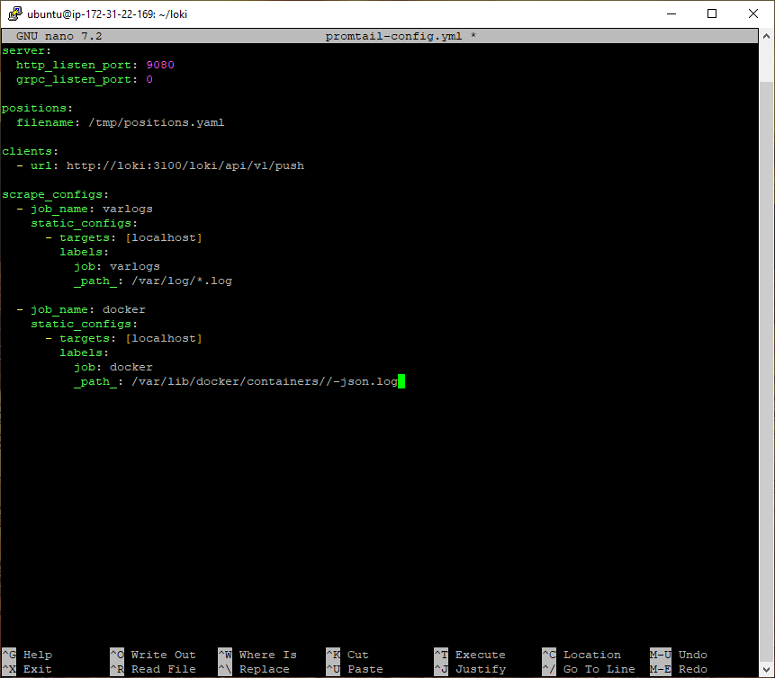

Bu doküman, AWS EC2 Ubuntu (ör. t2.micro) üzerinde **Kubernetes kullanmadan**, yalnızca **Docker Compose** ile hafif bir merkezi log izleme sisteminin nasıl kurulacağını anlatır.

---

### **Bileşenler**

* **Loki** — Log depolama ve sorgulama motoru
* **Promtail** — Log toplayıcı (host ve Docker container loglarını okur)
* **Grafana** — Görselleştirme ve sorgulama arayüzü

---

## 0) Önkoşullar

* AWS EC2 **Ubuntu 22.04/24.04** (SSH erişimi olmalı)
* Güvenlik Grubu (SG):

  * **22/tcp** (SSH) → açık
  * **3000/tcp** (Grafana) → açık
* Docker ve Docker Compose (plugin) yüklü

---

### 0.1) Windows’ta AWS CLI ile SG ayarı (PowerShell)

```powershell
$REGION="us-east-1"
$INSTANCE="i-073a3660e961324f8"
$SG=(aws ec2 describe-instances --instance-ids $INSTANCE --region $REGION --query "Reservations[0].Instances[0].SecurityGroups[0].GroupId" --output text)
$MYIP="$(Invoke-RestMethod -Uri https://ifconfig.me)/32"

# Eski NodePort kuralları varsa temizle (opsiyonel)
$ports = 30001,30300,30090
foreach ($port in $ports) {
  $cidrs = aws ec2 describe-security-groups --group-ids $SG --region $REGION --query "SecurityGroups[0].IpPermissions[?FromPort==`$port && IpProtocol=='tcp'].IpRanges[].CidrIp" --output text
  if ($cidrs) { ($cidrs -split "\s+") | % { aws ec2 revoke-security-group-ingress --group-id $SG --region $REGION --protocol tcp --port $port --cidr $_ } }
}

# 22 ve 3000 portlarını kendi IP’ne aç
aws ec2 authorize-security-group-ingress --group-id $SG --region $REGION --protocol tcp --port 22   --cidr $MYIP
aws ec2 authorize-security-group-ingress --group-id $SG --region $REGION --protocol tcp --port 3000 --cidr $MYIP
```

---

### 0.2) EC2 üzerinde Docker & Compose kurulumu (Ubuntu)

```bash
sudo apt-get update -y && sudo apt-get install -y ca-certificates curl gnupg lsb-release
sudo install -m 0755 -d /etc/apt/keyrings
curl -fsSL https://download.docker.com/linux/ubuntu/gpg | sudo gpg --dearmor -o /etc/apt/keyrings/docker.gpg
echo "deb [arch=$(dpkg --print-architecture) signed-by=/etc/apt/keyrings/docker.gpg] \
https://download.docker.com/linux/ubuntu $(lsb_release -cs) stable" \
| sudo tee /etc/apt/sources.list.d/docker.list > /dev/null
sudo apt-get update -y && sudo apt-get install -y docker-ce docker-ce-cli containerd.io docker-buildx-plugin docker-compose-plugin
sudo usermod -aG docker $USER && newgrp docker
docker --version && docker compose version
```

---

## 1) Kurulum — Dosyaları oluştur ve başlat

```bash
mkdir -p ~/loki && cd ~/loki
```

**! nano komutu ile

**docker-compose.yml**

```yaml
version: "3.8"
services:
  loki:
    image: grafana/loki:2.9.4
    command: -config.file=/etc/loki/local-config.yaml
    ports:
      - "3100:3100"
    volumes:
      - ./loki-config.yaml:/etc/loki/local-config.yaml:ro
    restart: unless-stopped

  promtail:
    image: grafana/promtail:2.9.4
    command: -config.file=/etc/promtail/config.yml
    volumes:
      - /var/log:/var/log:ro
      - /var/lib/docker/containers:/var/lib/docker/containers:ro
      - ./promtail-config.yml:/etc/promtail/config.yml:ro
    restart: unless-stopped
    depends_on:
      - loki

  grafana:
    image: grafana/grafana:10.4.0
    ports:
      - "3000:3000"
    environment:
      - GF_SECURITY_ADMIN_PASSWORD=ChangeMe123!
    volumes:
      - grafana-data:/var/lib/grafana
    restart: unless-stopped
    depends_on:
      - loki

volumes:
  grafana-data:
```

**loki-config.yaml**

```yaml
auth_enabled: false
server:
  http_listen_port: 3100
common:
  path_prefix: /loki
  storage:
    filesystem:
      chunks_directory: /loki/chunks
      rules_directory: /loki/rules
  replication_factor: 1
  ring:
    instance_addr: 127.0.0.1
    kvstore:
      store: inmemory
schema_config:
  configs:
    - from: 2020-10-24
      store: boltdb-shipper
      object_store: filesystem
      schema: v13
      index:
        prefix: index_
        period: 24h
limits_config:
  ingestion_rate_mb: 4
  ingestion_burst_size_mb: 6
  reject_old_samples: true
  reject_old_samples_max_age: 168h
```

**promtail-config.yml**

```yaml
server:
  http_listen_port: 9080
  grpc_listen_port: 0

positions:
  filename: /tmp/positions.yaml

clients:
  - url: http://loki:3100/loki/api/v1/push

scrape_configs:
  - job_name: varlogs
    static_configs:
      - targets: [localhost]
        labels:
          job: varlogs
          __path__: /var/log/*.log

  - job_name: docker
    static_configs:
      - targets: [localhost]
        labels:
          job: docker
          __path__: /var/lib/docker/containers/*/*-json.log
```

**Başlat:**

```bash
docker compose up -d
docker ps
```

---

## 2) Erişim ve Doğrulama

* **Grafana:** `http://EC2_PUBLIC_IP:3000`
  Kullanıcı: `admin`
  Parola: `ChangeMe123!`
* Grafana → **Data Sources** → *Add data source* → **Loki**

  * URL: `http://loki:3100`
  * **Save & Test**
* **Explore** sekmesinde `job=varlogs` veya `job=docker` ile logları görüntüleyin.

---

## 3) Sorun Giderme ve İpuçları

* **RAM sınırlıysa (t2.micro)**: `promtail-config.yml` içindeki `job: docker` bloğunu yoruma alabilirsiniz.
* **3000 portu çalışmıyorsa**: SG inbound kuralında **My IP** ile 3000 portunun açıldığını doğrulayın.
* **Log yolları farklıysa**: `__path__` değerlerini güncelleyin.

---

## 4) Güncelleme ve Temizleme

**Güncelleme:**

```bash
docker compose pull && docker compose up -d
```

**Temizleme:**

```bash
docker compose down -v
```

---

Bu kurulum, **AWS Free Tier** için en hafif ve hızlı merkezi log izleme yaklaşımıdır.
Daha gelişmiş ihtiyaçlarda Kubernetes/Helm (Minikube veya EKS) tercih edebilirsiniz.

---

### Görsel Galeri





